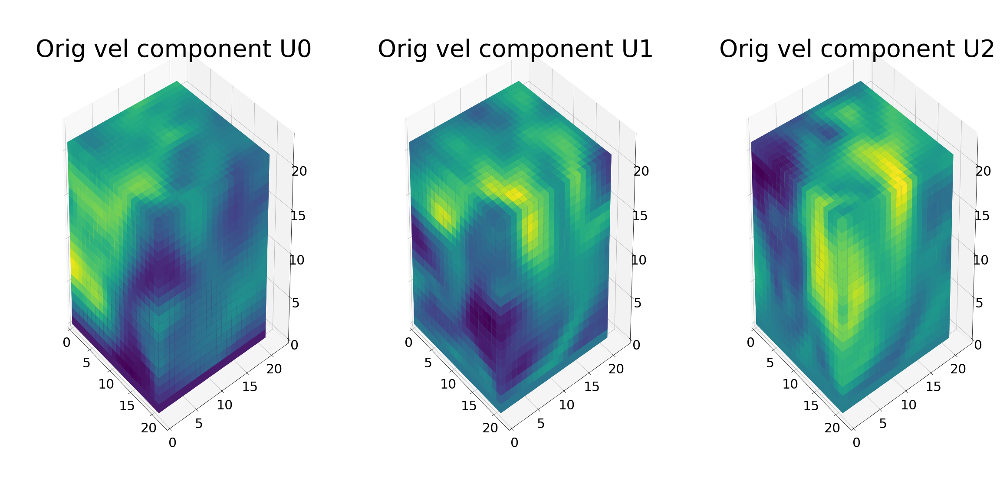
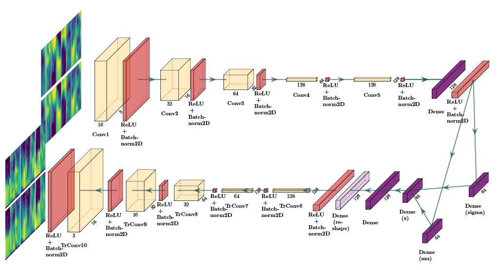

# 卷积-3D扰动数据

用于3D CFD数据重建和生成的卷积变异自动编码器（CVAE）。

## 项目摘要

在此项目中，我们实施了卷积变分自动编码器（CVAE）[1]来处理和重建3D湍流数据。

我们使用计算流体动力学（CFD）方法生成了3D湍流立方体，每个3D立方体沿三个速度组件（类似于图像数据的单独通道威胁）沿每个3D立方体提供物理信息）。

作为3D CFD数据预处理的一部分，我们编写了一个**自定义的Pytorch DataLoader **，该数据已在数据集中执行归一化和批处理操作。

CVAE在预处理的数据上实现了3D卷积（3DCONV），以执行3D重建和生成。

我们通过微调超参数并操纵我们的模型架构，对3D重建进行了重大改进。

## 数据描述

该数据集是使用CFD模拟方法生成的，它包含从加热通风和空调（HVAC）管道中提取的立方体。

每个立方体代表在特定时间携带物理信息的湍流的三维时间快照。从模拟中提取的信息基于两个流量组件：速度场 *u *和静压 *p *。 *u*field（*x*，*y*，*z*），标量*p*基于流动的方向（与立方体的正常方向）。

我们使用体素将3D立方表示为尺寸数组`21 × 21 × 21 x 100 (x_coord, y_coord, z_coord, timestep)`。下图显示了一个立方体数据样本，我们使用热图可视化每个速度分量。

<!--我们将两个速度组件的信息 *u_x *， *u_y *和 *p *作为使用Pyotch的3D卷积。-->

总共，数据集由96个模拟组成，每个模拟都有100个时间步长，总计9600个立方体（对于每个速度组件）。



**注意：**由于机密性问题，我们没有公开数据，您可以使用脚本并将其调整到您自己的3D数据中。

## 数据预处理

下面的脚本显示了写入预处理3D数据的自定义Pytorch数据加载程序。以下是一些亮点：

<ol>
<li>立方体速度通道的加载和串联</li>
<li>数据标准化</li>
<li>data scaling</li>
</ol>

看```dataloader.py```用于完整实施。

```python
class CFD3DDataset(Dataset):
    def __init__(self, data_directory, no_simulations, simulation_timesteps, transforms=None):
        """
        data_directory: path to directory that contains subfolders with the npy files
        Subfolders are folders containing each component of velocity: extract_cubes_U0_reduced
        """

        print()
        print("[INFO] started instantiating 3D CFD pytorch dataset")

        self.data_directory = data_directory
        self.no_simulations = no_simulations # 96
        self.simulation_timesteps = simulation_timesteps # 100
        self.transforms = transforms

        # data_dir = "../cfd_data/HVAC_DUCT/cubes/coords_3d/"
        data_directory_U0 = self.data_directory + "extract_cubes_U0_reduced/"
        data_directory_U1 = self.data_directory + "extract_cubes_U1_reduced/"
        data_directory_U2 = self.data_directory + "extract_cubes_U2_reduced/"

        # read cubes data from directories
        cubes_U0_dict = self._load_3D_cubes(data_directory_U0)
        cubes_U1_dict = self._load_3D_cubes(data_directory_U1)
        cubes_U2_dict = self._load_3D_cubes(data_directory_U2)

        # compare all folders have same simulation parameters
        if self._compare_U_sim_keys(cubes_U0_dict, cubes_U1_dict) and \
           self._compare_U_sim_keys(cubes_U0_dict, cubes_U2_dict) and \
           self._compare_U_sim_keys(cubes_U1_dict, cubes_U2_dict):
            print("[INFO] all folders have same keys (simulations)")
        else:
            print("[INFO] the folders don't have the same keys (simulations)")
            quit()

        # concatenate all velocity components into one dictionary data structure
        cubes_U_all_dict = self._merge_velocity_components_into_dict(cubes_U0_dict, cubes_U1_dict, cubes_U2_dict)

        # creates a list of length timesteps x simulations, each element is a numpy array with cubes size (21,21,21,3)
        # cubes_U_all_channels: 9600 with shape (21,21,21,3)
        self.cubes_U_all_channels = self._concatenate_3_velocity_components(cubes_U_all_dict)
        print("[INFO] cubes dataset length:", len(self.cubes_U_all_channels))
        print("[INFO] single cube shape:", self.cubes_U_all_channels[0].shape)
        self.data_len = len(self.cubes_U_all_channels)

        # stack all cubes in a final numpy array numpy (9600, 21, 21, 21, 3)
        self.stacked_cubes = np.stack(self.cubes_U_all_channels, 0)

        # standardize data from here
        print()
        print("[INFO] standardize data to mean 0 and std 1")
        self.standardized_cubes = self._standardize_cubes(self.stacked_cubes)
        print("mean after standardization:", self.standardized_cubes.mean(axis=(0,1,2,3)))
        print("std after standardization:", self.standardized_cubes.std(axis=(0,1,2,3)))

        print()
        print("[INFO] finished instantiating 3D CFD pytorch dataset")
        .
        .
        .
    def __getitem__(self, index):
        """
        Returns a tensor cube of shape (3,21,21,21) normalized by
        substracting mean and dividing std of dataset computed beforehand.
        """

        single_cube_numpy = self.standardized_cubes[index] # (21, 21, 21, 3)

        # min-max normalization, clipping and resizing
        single_cube_minmax = self._minmax_normalization(single_cube_numpy) # (custom function)
        single_cube_transformed = np.clip(self._scale_by(np.clip(single_cube_minmax-0.1, 0, 1)**0.4, 2)-0.1, 0, 1) # (from tutorial)
        single_cube_resized = resize(single_cube_transformed, (21, 21, 21), mode='constant') # (21,21,21)

        # swap axes from numpy shape (21, 21, 21, 3) to torch shape (3, 21, 21, 21) this is for input to Conv3D
        single_cube_reshaped = np.transpose(single_cube_resized, (3, 1, 2, 0))

        # convert cube to torch tensor
        single_cube_tensor = torch.from_numpy(single_cube_reshaped)

        return single_cube_tensor
```

## 模型架构

下图显示了实现的CVAE架构。在这种情况下，显示2DCONV为了清楚起见，但是实现的体系结构使用3DCONVS。

CVAE由**编码器网络**（上部）组成，然后是**变分层**（*mu*and*sigma*）（中右部件）（中右部件）和**解码器网络**（底部）。

编码器对输入立方体进行下采样操作，解码器将其示例为样本，以重新恢复原始形状。变分层试图学习数据集的分布，以后可以将其用于生成。




编码器网络由**四个** 3D卷积层组成，每一层的卷积过滤器数量分别为前一个卷积过滤器（分别为32、64、128和256），这使模型可以学习更多复杂的流量。

密集层用于结合从最后一个编码层获得的所有特征图，该层连接到计算后流数据分布的参数的变异层（*mu*and*sigma*，这些参数定义了概率分布，使用该概率的重新分布来允许我们从[1]中描述的重新分布，从`8 × 8 x 8`.

解码器网络采用潜在向量，并应用**四个** 3D转置卷积层以恢复（重建）原始数据尺寸，每个层的卷积过滤器的数量分别为前一个（256、128、64和32）。

CVAE经过两个损失函数训练：**用于重建的平均平方误差（MSE）**，** kullback-leibler Divergence（KLB）**用于正规化潜在空间。

我们以[2]和[3]中的超参数提出的基线体系结构为基线体系结构。

下面的脚本显示了Pytorch中的一个示例，其中编码器和解码器均使用3D卷积层（Conv3d）定义：


```python
self.encoder = nn.Sequential(
            nn.Conv3d(in_channels=image_channels, out_channels=16, kernel_size=4, stride=1, padding=0),
            nn.BatchNorm3d(num_features=16),
            nn.ReLU(),
            nn.Conv3d(in_channels=16, out_channels=32, kernel_size=4, stride=1, padding=0),
            nn.BatchNorm3d(num_features=32),
            nn.ReLU(),
            nn.Conv3d(in_channels=32, out_channels=64, kernel_size=4, stride=1, padding=0),
            nn.BatchNorm3d(num_features=64),
            nn.ReLU(),
            nn.Conv3d(in_channels=64, out_channels=128, kernel_size=4, stride=1, padding=0),
            nn.BatchNorm3d(num_features=128),
            nn.ReLU(),
            nn.Conv3d(in_channels=128, out_channels=128, kernel_size=4, stride=1, padding=0),
            nn.BatchNorm3d(num_features=128),
            nn.ReLU(),
            Flatten()
        )

self.decoder = nn.Sequential(
            UnFlatten(),
            nn.BatchNorm3d(num_features=128),
            nn.ReLU(),
            nn.ConvTranspose3d(in_channels=128, out_channels=128, kernel_size=4, stride=1, padding=0),
            nn.BatchNorm3d(num_features=128),
            nn.ReLU(),
            nn.ConvTranspose3d(in_channels=128, out_channels=64, kernel_size=4, stride=1, padding=0),
            nn.BatchNorm3d(num_features=64),
            nn.ReLU(),
            nn.ConvTranspose3d(in_channels=64, out_channels=32, kernel_size=4, stride=1, padding=0),
            nn.BatchNorm3d(num_features=32),
            nn.ReLU(),
            nn.ConvTranspose3d(in_channels=32, out_channels=16, kernel_size=4, stride=1, padding=0),
            nn.BatchNorm3d(num_features=16),
            nn.ReLU(),
            nn.ConvTranspose3d(in_channels=16, out_channels=image_channels, kernel_size=4, stride=1, padding=0), # dimensions should be as original
            nn.BatchNorm3d(num_features=3))        
```

## 设置环境

1）克隆这个存储库：

    ```
    git clone git@github.com:agrija9/Convolutional-VAE-for-3D-Turbulence-Data
    ```

1）建议使用虚拟环境运行此项目：

    * 你可以[install Anaconda](https://www.digitalocean.com/community/tutorials/how-to-install-anaconda-on-ubuntu-18-04-quickstart)并在系统中创建环境
    * 您可以使用PIP VENV创建环境

2）在您的PIP/CONDA环境中安装以下依赖项：

	* numpy（> = 1.19.2）
	* Food Plotlib（> = 3.3.2）
	* pytorch（> = 1.7.0）
	* 火炬（> = 0.8.1）
	* Scikit-learn（> = 0.23.2）
	* TQDM
	* TensorboardX
	* 火把
	* pil
	* 收藏

## 模型培训

要训​​练模型，打开终端，激活您的PIP/CONDA环境并类型：

```
cd /path-to-repo/Convolutional-VAE-for-3D-Turbulence-Data
python main.py --test_every_epochs 3 --batch_size 32 --epochs 40 --h_dim 128 --z_dim 64
```

以下是一些可以修改以训练模型的超参数

* ```--batch_size```每个补丁程序要处理的立方数
* ```--epochs```训练时期的数量
* ```--h_dim```隐藏密集层的尺寸（连接到变分层）
* ```--z_dim```潜在空间尺寸

``main.py`script称该模型并在3D CFD数据上进行训练。使用** nvidia tesla v100 gpu **训练100个时代大约需要2个小时。在这种情况下，该模型接受了170个时期的培训。

请注意，当训练3DCONVS模型时，与2DCONVS模型相比，学习参数的数量会呈指数增加，因此，对于3D数据而言，训练时间更长。

## （可选）集群中的模型训练

为了在集群中训练此模型，请传输数据，脚本并在集群中的环境中安装依赖项。

这```run_CVAE.sh```包含以下内容：

```bash
#!/bin/bash
#
#SBATCH --job-name=3D_data_CVAE
#SBATCH -o ./output_jobs/slurm.%j.out # STDOUT
#SBATCH -e ./output_jobs/slurm.%j.err #STDERR
#SBATCH --nodes=1
#SBATCH --ntasks=16
#SBATCH --time=20:00:00

# insert variables with sed before calling
date=2022-20-03_16:43

echo DATE and TIME $date

# set hyperparameters
batch_size=128
epochs=170
latent_length=64

# set model name and create the output directory
model_name=cvae_epochs_${epochs}_batch_size_${batch_size}_latent_size_${latent_length}_${date}
model_name_base=cvae
output=${model_name}_$date
mkdir -p /home/output_jobs/$model_name_base

# load module (custom anaconda environment)
module load Anaconda3/5.1.0
source /home/.bashrc
conda activate /home/conda-env
echo Modules loaded....

# print model/train info
echo Model $model_name
echo Reference $output
echo Training model for $epochs iterations
echo Calculate on $cores Cores

# run python script
CUDA_VISIBLE_DEVICES=6,7 /home/conda-env/bin/python /home/main.py --batch_size $batch_size --epochs $epochs --z_dim $latent_length
```

上面的bash脚本可以在slurm群集的GPU节点中运行，并具有以下命令：
```
srun -p gpu -n 1  --gres gpu:v100:2 --cpus-per-task=1 --mem-per-cpu=32gb --pty /bin/bash run_CVAE.sh
```

## 模型输出

训练Pytorch模型后，生成了具有训练重量的文件```checkpoint.pkl```.

在培训期间，在每个n-th-the时期的测试数据上评估模型，脚本将重建的与原始立方体进行比较，并将其保存为图像。此外，记录损失值并将```runs```文件夹，可以使用张板通过键入以下内容来可视化损耗曲线：

```
cd /path-to-repo/3D-CFD-Processing-CVAE
tensorboard --logdir=runs/
```

文件夹```runs/```如果没有创建，则会自动生成。

## 3D重建结果

在下图中，我们显示了每个 * n *时期相同的立方体样本的重建结果。

顶行包含原始立方体样品（对于每个速度通道）。底部行包含每个 * n *时期的重建输出。

在此示例中，我们显示了从0到355个时期的重建，间隔为15个时期。请注意，重建的改进是时期的函数。


## 3D生成结果

一旦训练了模型，一种直接的生成方法是初始化特定潜在维度的随机立方体阵列（例如，```8x8x8```）并将其通过解码器网络。

定性地，可以通过评估每个组件的速度字段来检查CFD立方体的产生。随着未来的工作，必须将更复杂的随机立方初始化与大会生成质量指标一起探索。

## 结论和观察

* 对于重建损失，均方根误差（MSE）已被证明比二进制 - 连接术（BCE）更好（请参阅```loss.py```)
* 为了使MSE和Kulback-Leibler Divergence（KLD）之间的放大率均衡，我们将MSE乘以0.1（请参阅```loss.py```)
* 由于3D立方体的大小，使用8或16的批次是合适的。较大的批次会导致内存超负荷
* 我们已经在模型的编码器和解码器中添加了一个额外的3DCONV层，以改善重建（请参阅```models.py```)
* 我们已经训练了最多355个时期的模型，可以进一步改善，因为损失值不断下降
* 在数据预处理中，我们发现在将立方体进近模型之前对标识和minmax缩放有用
* 潜在维度（Z_DIM）仍然可以修改，我们已经培训了34、90和128个潜在矢量，并且没有注意到重大更改
* 要进一步阅读，请参阅我在[4]中写的报告

## 未来的工作

* 研究立方体的聚类（在较低维度）：在墙壁与中间立方体之间存在聚类吗？
* 下一个任务将包括探索CVAE的发电能力
* 添加一种用于生成的方法：可以从哪种随机初始化立方体初始化的方法开始？
* 研究时间分量的4D CNN：4D CNNS
* 探索立方体大小的效果：当前输入大小为21x21x21，但这可能会增加
* 探索自定义损失功能：我们可以将更多的物理学插入损失功能吗？

## 参考

* [1] [Diederik P Kingma, Max Welling. Auto-Encoding Variational Bayes. December 2013](https://arxiv.org/abs/1312.6114)
* [2] [Victor Xing. Exploration of the ability of Deep Learning tolearn the characteristics of turbulent flows. November 2018.](https://cerfacs.fr/wp-content/uploads/2018/11/CFD_RAPSTAGE2018_XING.pdf)
* [3] [Irina Higgins, et. al. Learning basic visual concepts with a constrained variational framework. International Conference on Learning Representations (ICLR), 2017.](https://openreview.net/forum?id=Sy2fzU9gl)
* [4] [Generative Models for the Analysis of Dynamical Systems with Applications](https://pub.h-brs.de/frontdoor/index/index/docId/6041)
